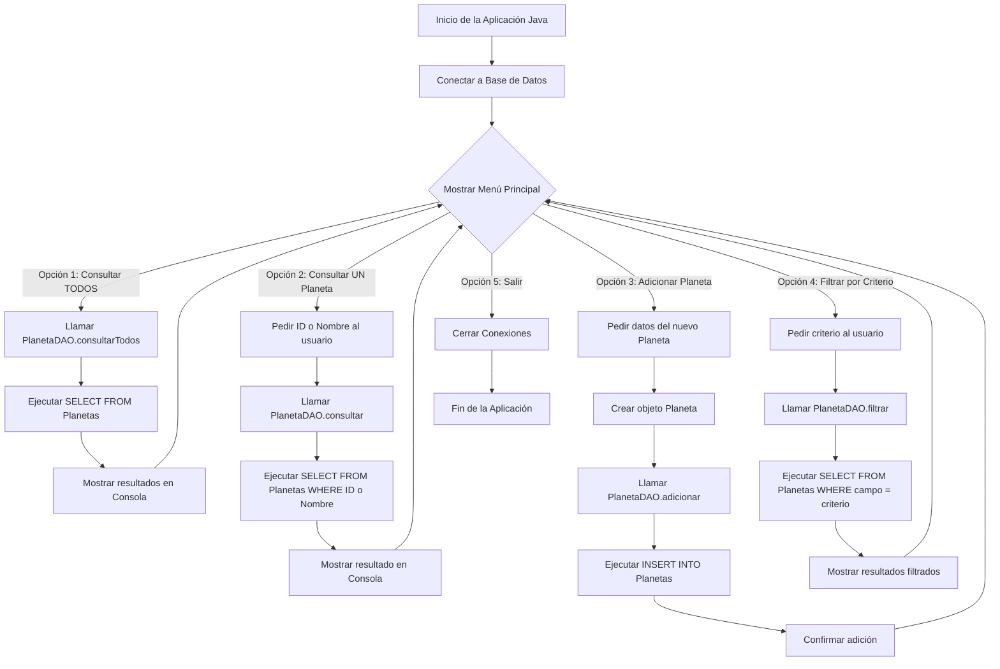

## 🚀 Diagrama de Flujo de la Aplicación
aqui esta el codigo con base de datos, sobre planeta y ak esta el diagrama de flujo sobre mi codigo

```mermaid
graph TD
    A[Inicio de la Aplicación Java] --> B[Conectar a Base de Datos]
    B --> C{Mostrar Menú Principal}

    C -->|Opción 1: Consultar TODOS| D[Llamar PlanetaDAO.consultarTodos]
    D --> D1[Ejecutar SELECT FROM Planetas]
    D1 --> D2[Mostrar resultados en Consola]
    D2 --> C

    C -->|Opción 2: Consultar UN Planeta| E[Pedir ID o Nombre al usuario]
    E --> E1[Llamar PlanetaDAO.consultar]
    E1 --> E2[Ejecutar SELECT FROM Planetas WHERE ID o Nombre]
    E2 --> E3[Mostrar resultado en Consola]
    E3 --> C

    C -->|Opción 3: Adicionar Planeta| F[Pedir datos del nuevo Planeta]
    F --> F1[Crear objeto Planeta]
    F1 --> F2[Llamar PlanetaDAO.adicionar]
    F2 --> F3[Ejecutar INSERT INTO Planetas]
    F3 --> F4[Confirmar adición]
    F4 --> C

    C -->|Opción 4: Filtrar por Criterio| G[Pedir criterio al usuario]
    G --> G1[Llamar PlanetaDAO.filtrar]
    G1 --> G2[Ejecutar SELECT FROM Planetas WHERE campo = criterio]
    G2 --> G3[Mostrar resultados filtrados]
    G3 --> C

    C -->|Opción 5: Salir| H[Cerrar Conexiones]
    H --> I[Fin de la Aplicación]
```

